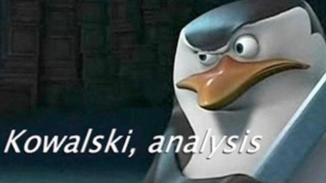

<!-- javascript to toggle boxes(remember to indent it) -->
  <script language="javascript"> 
    function toggle(num) {
      var ele = document.getElementById("toggleText" + num);
      var text = document.getElementById("displayText" + num);
      if(ele.style.display == "block") {
        ele.style.display = "none";
        text.innerHTML = "show";
      }
      else {
        ele.style.display = "block";
        text.innerHTML = "hide";
      }
   } 
  </script>
 

<!-- insert a new line -->
<br />  

## Penguins dataset

We will be using the [Penguins dataset](https://allisonhorst.github.io/palmerpenguins/) through this seminar. You can install it by running

```{r, results='hide',  message=FALSE, warning=FALSE}
install.packages("palmerpenguins") 
```
You can then load the data:
```{r, results='hide',  message=FALSE, warning=FALSE}
library(palmerpenguins)
data(penguins)
```

Some of the observations in the dataset have missing values. For now, we will just ignore these observations. We will use the function *drop_na()* from the [tidyverse](https://www.tidyverse.org/) package (we will also be using some other tidyverse functions through this seminar).
```{r, results='hide',  message=FALSE, warning=FALSE}
library(tidyverse)
data(penguins)

penguins <- drop_na(penguins)

```

We will now proceed with the 
<!-- call to javascript to insert toggle boxe --> 
<a id="displayText" href="javascript:toggle(0);">analysis</a> of the dataset. 
<div id="toggleText0" style="display: none">



<!-- call to javascript to end current toggle boxe -->   
</div>
<br/>  

## Linear regression model

We are interested in the penguin's physiology. To begin with, we want to understand the relationship between 
size of the penguin's bill and the overall penguin mass.

{width=50%}

To do that, we will fit a linear model
$$
\text{body_mass_g} = \beta_0 + \beta_1 \times \text{bill_length_mm} +  \beta_2 \times \text{bill_depth_mm} + \epsilon
$$

In R, you can achieve this by 
```{r, results='hide',  message=FALSE, warning=FALSE}
model <-  lm(formula = body_mass_g ~ bill_length_mm + bill_depth_mm,
             data = penguins)
```
The *model* variable contains the raw results of the regression model. We can use the *summary()* function to process the raw results and compute additional statistics; we then display the summary of the model:
```{r, results='hide',  message=FALSE, warning=FALSE}
model_summary <- summary(model)
print(model_summary)
```

 * Take a look at the results. How would you interpret them?
 * If we would have only 1 explanatory variable, you could think about the model as a line, with $\beta_1$ being its slope. Here, we have 2 explanatory variables (*bill_length_mm* and *bill_depth_mm*). How does this model look like geometrically? What if we would have even more explanatory variables?
 * The mass of the penguin is measured in grams, and the bill length and depth are measured in millimeters: 
    - What are the physical units of $\beta_0, \beta_1, \beta_2$ and $\epsilon$?
    - Your colleague, honorable British lord Luke, suggested measuring the weight of penguins in pounds instead of grams. How is that going to affect our model?
    

You decided to include the information about the penguin's sex and the island where the penguin was observed in the explanatory variables. Fit this model in R.

 * The information about sex and island are written as a text in the data, but the regression model calculates with numerical values. How are these variables going to be represented numerically?
 * Take a look at the results; compare them with the previous model.
 
You decided to further improve the model by including the information about penguin species in the explanatory variables.

* Again, compare the results with the previous model. How did the statistical significance of the model parameters change?

## Linear model implementation

So far, we relied on the *lm()* function, which estimates $\boldsymbol{\beta}$ parameters. As we discussed previously, linear model estimates

$$
\hat{\boldsymbol{\beta}}
=
\left( X^T X \right)^{-1} X^T \boldsymbol{y}
$$

where $X$ is the design matrix and $\boldsymbol{y}$ is the response vector.

Implement the estimation manually, for the model that uses *bill length*, *bill depth*, *sex*, and *island* as explanatory variables.

Compare the result to *lm()* (your $\beta$ coefficients should be the same).


Below is the R syntax for basic matrix operations for your convenience:

| Operation | Meaning | R syntax |
|----------|--------|----------|
| Matrix multiplication | $AB$ | `A %*% B` |
| Transpose | $A^T$ | `t(A)` |
| Inverse | $A^{-1}$ | `solve(A)` |
| Identity matrix | $I$ | `diag(n)` |
| Convert to matrix | — | `as.matrix(x)` |

<!-- call to javascript to insert toggle boxe --> 
<a id="displayText11" href="javascript:toggle(11);">Show solution</a> 
<div id="toggleText11" style="display: none">
```r
# Response vector
y <- penguins$body_mass_g

# Design matrix
X <- cbind(
  intercept = 1,
  bill_length_mm = penguins$bill_length_mm,
  bill_depth_mm = penguins$bill_depth_mm,
  sexmale = as.numeric(penguins$sex == "male"),
  islandDream = as.numeric(penguins$island == "Dream"),
  islandTorgersen = as.numeric(penguins$island == "Torgersen")
)

beta_hat <- solve(t(X) %*% X) %*% t(X) %*% y

lm_model_summary <- summary(lm(body_mass_g ~ bill_length_mm + bill_depth_mm + sex + island, data = penguins))

print(lm_model_summary)
print(beta_hat)
```

<!-- call to javascript to end current toggle boxe -->   
</div>
<br/> 

## Data visualization

It's usually a good idea to visualize the dataset in various ways; this can help you a lot with the interpretation of the data and the models fitted on them. 

* You can obtain a basic summary statistics of the dataframe by calling:
```{r, results='hide',  message=FALSE, warning=FALSE}
summary(penguins)
```

 * To visualize values of single variable - use barplot for categorical variables, and histogram or estimated density function for continuous variables. 
    * What is the relation between histograms and [kernel density estimate](https://en.wikipedia.org/wiki/Kernel_density_estimation)?

<!-- call to javascript to insert toggle boxe --> 
<a id="displayText13" href="javascript:toggle(13);">Show solution</a> 
<div id="toggleText13" style="display: none">


```{r}
barplot_species <- ggplot(penguins, aes(x = species, fill = species)) +
  geom_bar() +
  labs(
    x = "Species",
    y = "Count",
    title = "Number of Penguins per Species"
  ) +
  theme_minimal() +
  theme(
    plot.title = element_text(hjust = 0.5, size = 16),
    axis.title = element_text(size = 14),
    axis.text = element_text(size = 12),
    legend.title = element_text(size = 13),
    legend.text = element_text(size = 11)
  )
print(barplot_species)
```
```{r}
histogram_body_mass <- ggplot(penguins, aes(x = body_mass_g)) +
  geom_histogram(binwidth = 200, fill = "steelblue", color = "white") +
  labs(
    x = "Body Mass (g)",
    y = "Count",
    title = "Histogram of Body Mass"
  ) +
  theme_minimal() + 
  theme(
    plot.title = element_text(hjust = 0.5, size = 16),
    axis.title = element_text(size = 14),
    axis.text = element_text(size = 12),
    legend.title = element_text(size = 13),
    legend.text = element_text(size = 11)
  )

print(histogram_body_mass)
```

```{r}
density_body_mass <- ggplot(penguins, aes(x = body_mass_g)) +
  geom_density(fill = "steelblue", alpha = 0.7) +
  labs(
    x = "Body Mass (g)",
    y = "Density",
    title = "Density Plot of Body Mass"
  ) +
  theme_minimal() + 
  theme(
    plot.title = element_text(hjust = 0.5, size = 16),
    axis.title = element_text(size = 14),
    axis.text = element_text(size = 12),
    legend.title = element_text(size = 13),
    legend.text = element_text(size = 11)
  )

print(density_body_mass)
```

<!-- call to javascript to end current toggle boxe -->   
</div>
<br/> 

 * To visualize the relationship between 2 categorical variables, you can display [contingency table](https://en.wikipedia.org/wiki/Contingency_table) or use stacked barplot. For continuous variables, you can use a scatter plot; you can also use color code to display additional variable in the scatter plot. 
    * Display a scatter plot of penguin body mass versus bill depth, color-coded by the species (or look at the provided example below). Read about the [Simpson's paradox](https://en.wikipedia.org/wiki/Simpson%27s_paradox). How does it relate to the results of the models we fitted earlier?
 
 <!-- call to javascript to insert toggle boxe --> 
<a id="displayText2" href="javascript:toggle(2);">Show solution</a> 
<div id="toggleText2" style="display: none">

```{r}
contingency_table <- table(penguins[,c('sex', 'species')])
print(contingency_table)
```

```{r}
stacked_barplot <- ggplot(penguins, aes(x = island, fill = species)) +
    geom_bar(position = "stack") +
    labs(
        x = "Island",
        y = "Count",
        title = "Number of Penguins per Island (Stacked by Species)"
    ) +
    theme_minimal() +
    theme(
        plot.title = element_text(hjust = 0.5, size = 16),
        axis.title = element_text(size = 14),
        axis.text = element_text(size = 12),
        legend.title = element_text(size = 13),
        legend.text = element_text(size = 11)
    )

print(stacked_barplot)

```

```{r}
scatterplot <- ggplot(penguins, aes(x = bill_depth_mm, y = body_mass_g, color = species)) +
     geom_point() +
     labs(
         x = "Bill Depth (mm)",
         y = "Body Mass (g)",
         title = "Scatter Plot of Bill Depth vs Body Mass"
     ) +
     theme_minimal() +
     theme(
         plot.title = element_text(hjust = 0.5, size = 16),
         axis.title = element_text(size = 14),
         axis.text = element_text(size = 12),
         legend.title = element_text(size = 13),
         legend.text = element_text(size = 11)
     )
print(scatterplot)
```

<!-- call to javascript to end current toggle boxe -->   
</div>
<br/>  
